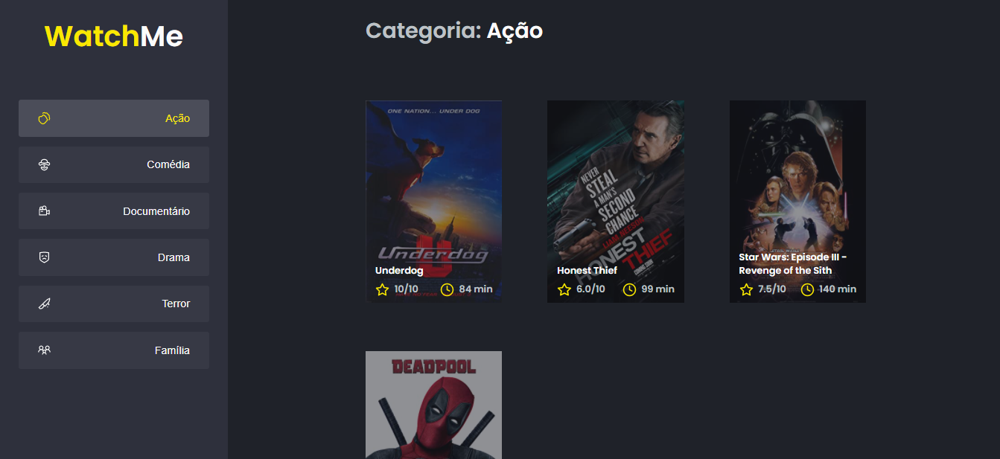
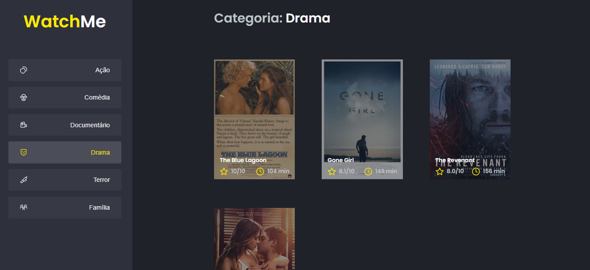

<h1 align="center"> Second challenge in ReactJS by Ignite </h1>

 Segundo desafio em ReactJS pelo Ignite 

  

---

  

## 💻 Desafio:

Diante o desafio realizado o seu principal objetivo foi refatorar uma página para listagem de filmes(WatchMe) de acordo com o gênero. 
A aplicação já estava totalmente funcional mas grande parte do seu código estava diretamente no arquivo `App.tsx`. 
Para resolver isso da melhor forma, foi necessário dividir a aplicação em duas partes principais: SideBar e o Content(conteúdo principal que possui o header e a listagem de filmes) para solucionar a refatoração.

* Foi utilizado Fake API como JSON Server para simular uma API que possui as informações de gêneros e filmes. 
* A aplicação possui apenas uma funcionalidade principal que é a listagem de filmes;
* Na sidebar é possível selecionar qual categoria de filmes deve ser listada;
* A primeira categoria da lista (que é "Ação") já deve começar como marcada;
* O header da aplicação possui apenas o nome da categoria selecionada que deve mudar dinamicamente.

## Tecnologias:

Esse projeto foi desenvolvido com as seguintes tecnologias:

- ReactJS + TypeScript 

---

Utilizando o template da Rocktetseat e feito com ajuda da Rocketseat.
